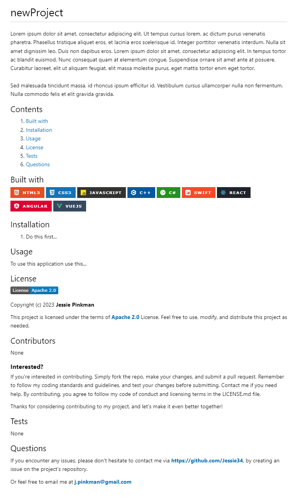

# Professional README Generator

The README Generator is a **command-line interface (CLI)** application built with [Node.js](https://nodejs.org/en/) and the [npm package Inquirer](https://www.npmjs.com/package/inquirer). It was created to simplify the process of creating a README file for a project by prompting the user with a series of questions about their project. Once the user has answered all the prompts, the README file is automatically generated and saved in the **Generated file** directory.

Creating a good README file is important as it provides critical information about the project, including its purpose, how to install and use it, and how to contribute to it. However, writing a good README file can be time-consuming and often neglected. With the README Generator, users can quickly and easily create a README file that meets their project's needs.

### Preview




### Built with

- 
- 
- 

### Installation

1. Clone this repository to your local machine using the following command:

```sh
   git clone https://github.com/Murtaza34/README-Generator.git
```

2. Install NPM packages:

```sh
   npm install
```

3. To start the application, run the following command in your terminal:

```sh
   node index.js
```

### Contributing

If you're interested in contributing, Simply fork the repo, make your changes, and submit a pull request. Remember to follow my coding standards and guidelines, and test your changes before submitting. Contact me if you need help. By contributing, you agree to follow my code of conduct and licensing terms in the LICENSE.md file.

Thanks for considering contributing to my project, and let's make it even better together!

### License

[](https://opensource.org/licenses/MIT)

Copyright (c) 2023 Murtaza Mohebi

This project is licensed under the MIT License. Feel free to use, modify, and distribute this project as needed.